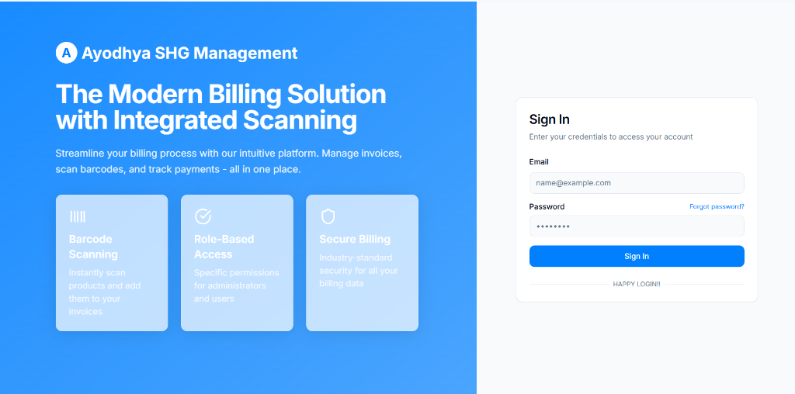
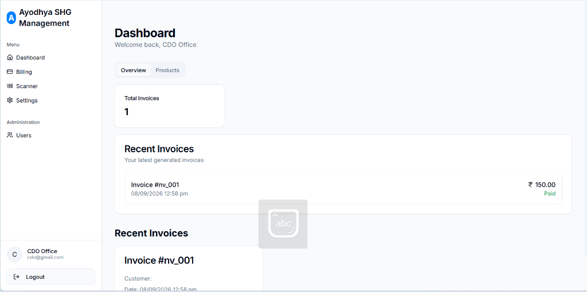
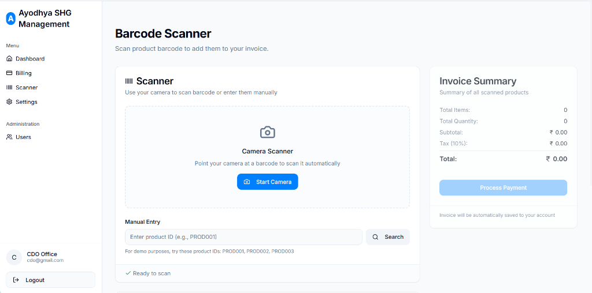
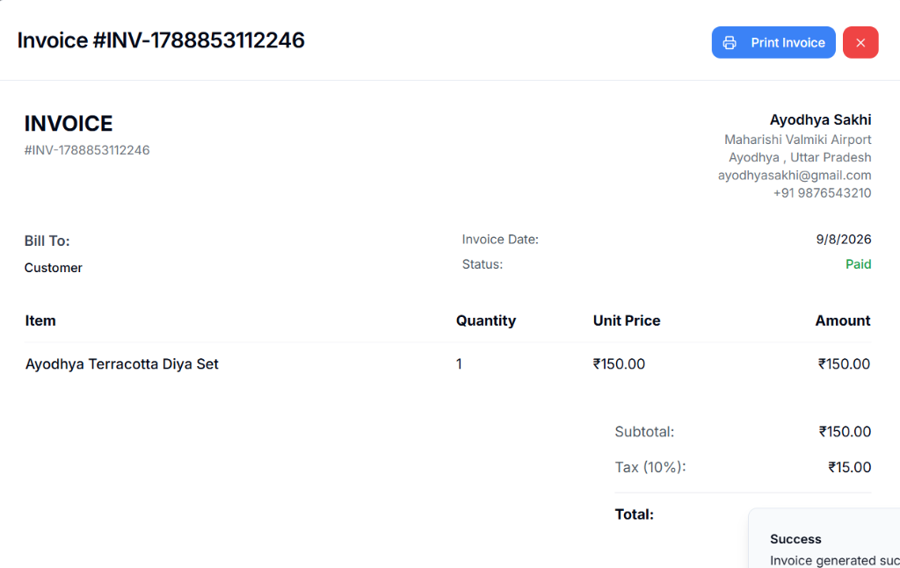
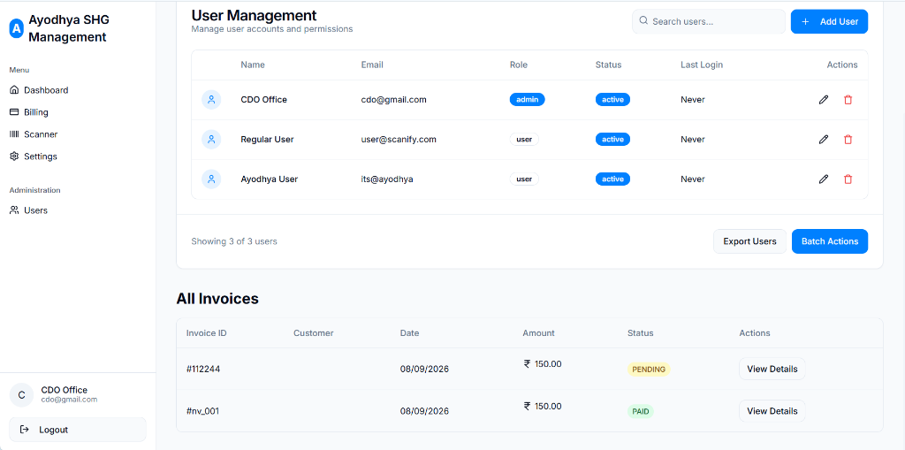

<div align="center">

# 📦 QR Inventory Mate
### *The Next-Generation QR & Barcode Inventory Management and Smart Billing System*

[](https://reactjs.org/)
[](https://vitejs.dev/)
[](https://www.typescriptlang.org/)
[](https://tailwindcss.com/)
[](https://ui.shadcn.com/)
[](https://nodejs.org/)
[](https://expressjs.com/)
[](./LICENSE)

<br/>

[🚀 Live Demo](https://qr-inventory-mate.vercel.app) · [🐛 Report Bug](https://github.com/KeyToCoding/Inventory-Management-System/issues) · [💡 Request Feature](https://github.com/KeyToCoding/Inventory-Management-System/issues)

</div>

---

## 📖 Overview

**QR Inventory Mate** (Ayodhya SHG Management) is an all-in-one inventory tracking, barcode-enabled billing, and store administration portal. Engineered for retail stores, Self-Help Groups (SHGs), and warehouse management, it unifies **real-time barcode scanning**, **instant invoice generation**, **automated stock deduction**, and **multi-tier user administration** into a single modern web application.

---

## 📸 Application Showcase

### 1. 🔐 Clean & Secure Authentication
> Modern sign-in portal equipped with role-based routing (`admin` / `user`) and JWT security.

<div align="center">
  
</div>

---

### 2. 📊 Executive Admin Dashboard
> Real-time operational overview with live invoice metrics, recent transactions, quick actions, and product catalog access.

<div align="center">
  
</div>

---

### 3. 📷 Smart Barcode Scanner & Rapid Checkout
> Point-and-shoot camera barcode scanner paired with manual SKU/product lookup, live cart calculation, dynamic tax (10%), and one-click payment processing.

<div align="center">
  
</div>

---

### 4. 📄 Itemized Invoices & Printable Receipts
> Auto-generated, professional invoices featuring store branding, buyer credentials, itemized quantity/pricing breakdowns, and native print-to-PDF support.

<div align="center">
  
</div>

---

### 5. 👥 User Governance & Role Management
> Administrative control center to provision staff accounts, assign granular role permissions (`admin` / `user`), toggle active statuses, and audit all invoice logs.

<div align="center">
  
</div>

---

## ✨ Key Features

- **⚡ Blazing Fast Architecture**: Powered by Vite and React 18 for instant hot module reloading and sub-second page loads.
- **📷 Camera Barcode Scanner**: Built-in camera scanner with real-time barcode decoding and automatic cart addition.
- **⌨️ Instant Product Lookup**: Fast manual SKU and product search fallback for quick checkout.
- **🧾 Automated Billing & Tax Engine**: Real-time subtotal, GST/tax computation, and single-click checkout with automatic stock deduction.
- **🖨️ Print-Ready Invoices**: Print beautiful thermal/A4 customer receipts directly from the browser.
- **👥 Role-Based Access Control (RBAC)**: Secure access delegation between Admins and standard Cashiers/Users.
- **🔄 Resilient Dual-Mode Backend**: Connects to remote **MongoDB Atlas** or smoothly falls back to a **Local Persistent Offline Engine** when cloud connection is unavailable.
- **🎨 Glassmorphic & Accessible UI**: Hand-crafted with Tailwind CSS, Lucide icons, and Radix UI (shadcn/ui).

---

## 🛠️ Tech Stack

| Domain | Technologies |
| :--- | :--- |
| **Frontend Framework** | [React 18](https://reactjs.org/) + [TypeScript](https://www.typescriptlang.org/) |
| **Build & Dev Tool** | [Vite 5](https://vitejs.dev/) + SWC Compiler |
| **Styling & Components**| [Tailwind CSS](https://tailwindcss.com/) · [shadcn/ui](https://ui.shadcn.com/) · [Lucide React](https://lucide.dev/) |
| **Routing & State** | [React Router DOM v6](https://reactrouter.com/) · [TanStack React Query v5](https://tanstack.com/query) |
| **Backend Runtime** | [Node.js](https://nodejs.org/) · [Express.js](https://expressjs.com/) |
| **Authentication** | [JWT (JSON Web Tokens)](https://jwt.io/) · [bcryptjs](https://github.com/dcodeIO/bcrypt.js) |
| **Database** | [MongoDB](https://www.mongodb.com/) (Mongoose ODM) with Local JSON Persistence Fallback |

---

## 🚀 Quick Start (Local Development)

### 1. Prerequisites
Ensure you have **Node.js (v18 or higher)** and **npm** installed on your system.
```bash
node -v
npm -v
```

### 2. Clone Repository
```bash
git clone https://github.com/KeyToCoding/Inventory-Management-System.git
cd Inventory-Management-System
```

### 3. Install Dependencies
Install dependencies for both frontend and backend:
```bash
# Install root (frontend) dependencies
npm install

# Install backend dependencies
cd backend
npm install
cd ..
```

### 4. Start the Application

#### Option A: Start Both Services
Open two terminal tabs:

**Terminal 1 (Backend API on Port 5000):**
```bash
cd backend
npm start
```

**Terminal 2 (Frontend on Port 8080):**
```bash
npm run dev
```

Visit **[http://localhost:8080](http://localhost:8080)** in your browser! 🎉

---

## 🔐 Authentication & Roles

The portal implements multi-tiered access control:
- **Admin**: Full access to analytics dashboard, product inventory, user provisioning, and centralized invoice management.
- **User**: Standard store cashier/staff access dedicated to barcode scanning, product lookup, and customer checkout.

---

## 🔌 API Endpoints Reference

### Authentication (`/api/auth`)
- `POST /api/auth/login` - Authenticate user & return JWT token
- `POST /api/auth/register` - Create a new user account
- `GET /api/auth/me` - Get profile of authenticated user
- `GET /api/auth/users` - List all users *(Admin only)*
- `PATCH /api/auth/users/:id/status` - Toggle user active status *(Admin only)*
- `PUT /api/auth/users/:id` - Update user details *(Admin only)*
- `DELETE /api/auth/users/:id` - Delete user account *(Admin only)*

### Product Inventory (`/api/products`)
- `GET /api/products` - Fetch all inventory products
- `GET /api/products/search?q=:query` - Search products by ID, name, or category
- `GET /api/products/:id` - Fetch single product details
- `POST /api/products` - Add new product with barcode ID
- `PUT /api/products/:id` - Update product details or stock
- `DELETE /api/products/:id` - Remove product from inventory

### Billing & Invoices (`/api/billing`)
- `GET /api/billing/invoices` - List all customer invoices *(Admin only)*
- `GET /api/billing/invoices/recent?limit=5` - Fetch recent invoices
- `GET /api/billing/invoices/:id` - Fetch invoice details by ID
- `POST /api/billing/invoices` - Create invoice & automatically decrement product stock
- `PATCH /api/billing/invoices/:id/status` - Update invoice payment status
- `DELETE /api/billing/invoices/:id` - Delete invoice record

---

## 📁 Project Structure

```text
Inventory-Management-System/
├── backend/
│   ├── data/                 # Local offline database persistence (db.json)
│   ├── src/
│   │   ├── middleware/       # JWT auth & admin guard middleware
│   │   ├── models/           # Mongoose schemas (User, Product, Invoice, Billing)
│   │   ├── routes/           # Express API route controllers
│   │   ├── scripts/          # Seeding & admin management scripts
│   │   ├── localFallback.js  # Resilient offline database & API router
│   │   └── server.js         # Backend server entrypoint
│   └── package.json
├── public/                   # Static public assets
├── screenshots/              # High-resolution README showcase photos
│   ├── login-page.png
│   ├── dashboard.png
│   ├── billing-scanner.png
│   ├── invoice-details.png
│   └── user-management.png
├── src/
│   ├── components/           # Reusable UI & shadcn/ui components
│   ├── contexts/             # React Contexts (AuthContext, ProductContext)
│   ├── layouts/              # Main application sidebar & responsive layout
│   ├── pages/                # App pages (Index, Dashboard, Scanner, Billing, AdminPanel)
│   ├── services/             # Axios API service clients
│   ├── App.tsx               # Route declarations & provider wrapper
│   └── main.tsx              # DOM mount point
├── vite.config.ts            # Vite bundler & reverse proxy configuration
└── README.md
```

---

## 🌐 Deployment

| Platform | Target | Build Command | Output Dir | Guide |
| :--- | :--- | :--- | :--- | :--- |
| **Vercel** | Frontend (Vite) | `npm run build` | `dist` | [Deploy on Vercel](https://vercel.com/new) |
| **Netlify** | Frontend (Vite) | `npm run build` | `dist` | [Deploy on Netlify](https://app.netlify.com/start) |
| **Render** | Backend (Express) | `npm install` | `node src/server.js` | [Deploy on Render](https://render.com) |

---

## 🤝 Contributing

Contributions are always welcome!
1. Fork the Project
2. Create your Feature Branch (`git checkout -b feature/AmazingFeature`)
3. Commit your Changes (`git commit -m 'Add some AmazingFeature'`)
4. Push to the Branch (`git push origin feature/AmazingFeature`)
5. Open a Pull Request

---

## 📄 License

Distributed under the **MIT License**. See [`LICENSE`](./LICENSE) for more details.

---

## 👨‍💻 Author

**Kartikey**

[](https://github.com/KeyToCoding)
[](https://www.linkedin.com/in/kartikey28/)

<div align="center">
  <sub>Made with ❤️ by Kartikey. If you find this project useful, consider giving it a ⭐!</sub>
</div>
